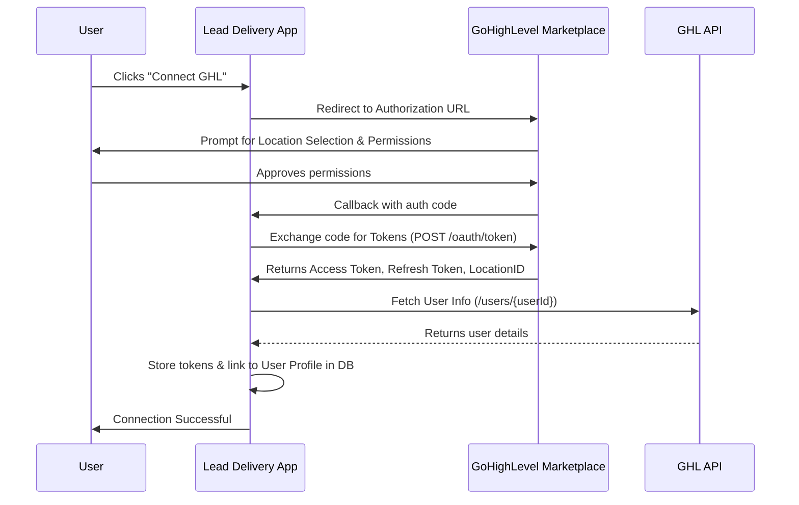

# OAuth Flow Documentation

The application integrates with GoHighLevel (GHL) using OAuth 2.0 to manage lead delivery to specific user locations.

## Overview

We use [NextAuth.js](https://next-auth.js.org/) to handle the OAuth handshake. The integration is configured with a custom provider for GHL.

### Key Components
- **Provider ID**: `gh`
- **Scopes**: `contacts.write`, `contacts.readonly`, `locations/customValues.readonly`, `locations/customValues.write`, `locations/customFields.readonly`, `locations/customFields.write`, `locations.readonly`, `opportunities.readonly`, `opportunities.write`, `calendars.readonly`, `calendars.write`, `users.readonly`, `users.write`, `oauth.write`, `oauth.readonly`.

## Sequence Diagram

## Token Management

### Storage
Tokens are stored in the `User` table:
- `accessToken`: Used for API requests.
- `refreshToken`: Used to obtain new access tokens when they expire.
- `tokenExpiresAt`: Timestamp when the current access token expires.

### Token Exchange
When the user connects, we request `user_type: Location` to ensure we get the `locationId` associated with the connection.

## Automatic Token Refresh

The application (via NextAuth and worker logic) handles token refresh using the `refreshToken` when the `accessToken` is nearing expiration.
